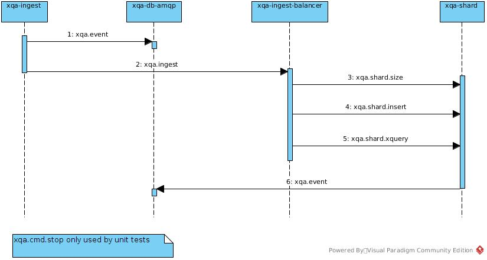

# xqa-ingest    
* XML file loader.

## 1. AMQP Destinations

## 2. Build
* ./build.sh

## 3. Bring up
* docker-compose up -d xqa-message-broker

### 4. Test

### 4.1. Maven
* see .travis.yml

### 4.2. CLI
* java -jar target/xqa-ingest-1.0.0-SNAPSHOT-jar-with-dependencies.jar -message_broker_host 127.0.0.1 -path $HOME/GIT_REPOS/xqa-test-data

or

* docker run -d --net="xqa-ingest_xqa" --name="xqa-ingest" -v $HOME/GIT_REPOS/xqa-test-data:/xml xqa-ingest:latest -message_broker_host xqa-message-broker -path /xml

## 5. Teardown
* docker-compose down -v
